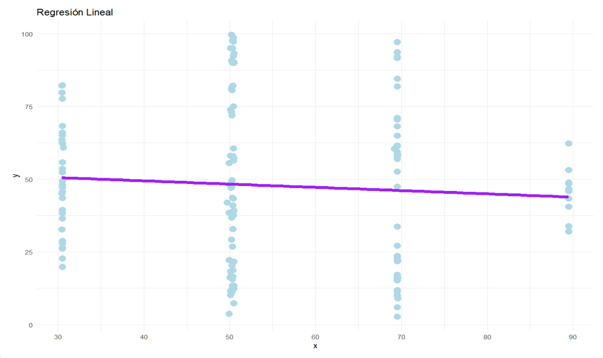
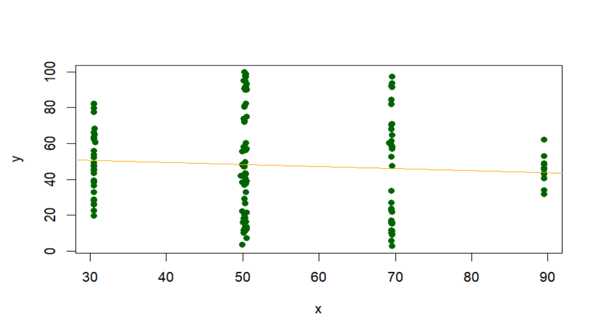

# **Herramientas utilizadas para la regresión lineal**

Las herramientas que se usaron son las siguientes:

- **ggplot2**: es una biblioteca para la creación de graficos y visualizaciones, es una de las mas populares de R 

- **geom_smooth()**: es una funcion de ggplot para agregar lineas de suavizados a un grafico

- **lm(Linear Model):** es una funcion que ajusta modelos lineales, que son herramientas estadisticas para explorar y cuantificar relaciones entre variables.

# Codigo

Calculamos la regresion
```{r}
    #Calcular la regresión lineal
    regresion <- lm(y~x,data=dfgrupo)
    #Mostrar el resumen de la regresion
    summary(regresion)
```

Se graficó de dos manera con y sin geom_smooth()

- Sin geom_smooth()

    ```{r}
    #graficamos los puntos y la linea de regresión
    plot(dfgrupo$x, dfgrupo$y, xlab='x',    ylab='y', col='darkgreen',pch = 16)
    abline(regresion, col='orange')
    ```
- Con geom_smmoth()
    ```{r}
    # Graficar los puntos y la línea de regresión usando ggplot2 y geom_smooth
    ggplot(dfgrupo, aes(x = x, y = y)) +
    geom_point(color = 'lightblue', size =4 ) +  # Puntos en color azul y tamaño 2
    geom_smooth(method = 'lm', color = 'purple', se = FALSE,size=2) +  # Línea de regresión en color rojo
    labs(title = 'Regresión Lineal', x = 'x', y = 'y') +  # Títulos y etiquetas de los ejes
    theme_minimal()  # Tema para mejorar la apariencia
    ```

# Resultado

Con geom_smooth



Sin geom_smooth

